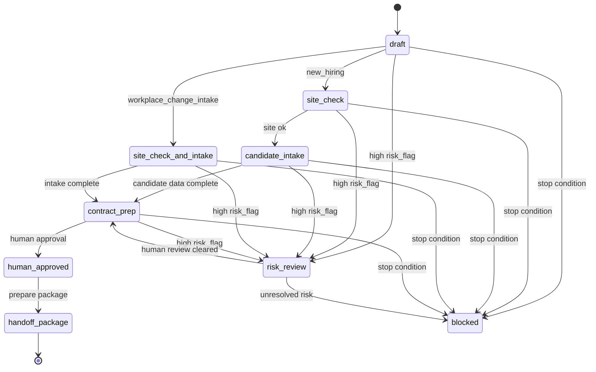

# 상태 머신

## 1. 목적

이 문서는 LangGraph node 구현 전에 Workforce 관련 work item의 MVP 업무 상태 전이를 정의한다.

`docs/GRAPH_STATE.md`는 런타임에서 공유하는 state 객체를 정의한다. 이 문서는 그 runtime state 안에서 허용되는 업무 흐름을 정의한다.

---

## 2. State 이름

```txt
draft
site_check
candidate_intake
site_check_and_intake
contract_prep
risk_review
blocked
human_approved
handoff_package
```

State 이름은 lower snake case로 유지한다. `docs/SCHEMA_CONTRACT.md`의 `current_state` / `next_state` 필드에서 이 값을 사용한다.

---

## 3. Case Type별 흐름

### new_hiring

```txt
draft -> site_check -> candidate_intake -> contract_prep -> human_approved
```

### workplace_change_intake

```txt
draft -> site_check_and_intake -> contract_prep -> human_approved
```

---

## 4. 공통 전이

```txt
any_state -> blocked
any_state -> risk_review
human_approved -> handoff_package
```

`blocked`는 Stop Condition에 걸렸거나, 필수 metadata가 없거나, 금지 요청이 감지됐거나, 시스템이 안전하게 계속 진행할 수 없을 때 사용한다.

`risk_review`는 `risk_flags`에 high-risk 항목이 있어 workflow 진행 전 사람 검토가 필요할 때 사용한다.

`handoff_package`는 사람 승인 이후에만 사용한다. 이 상태는 handoff package 준비를 의미하며, 외부 자동 전달을 의미하지 않는다.

---

## 5. Mermaid 다이어그램



---

## 6. 전이 표

| case_type | from | to | 트리거 |
|---|---|---|---|
| new_hiring | draft | site_check | 요청이 신규 채용으로 분류됨. |
| new_hiring | site_check | candidate_intake | 사업장 확인이 통과됨. |
| new_hiring | candidate_intake | contract_prep | 필요한 후보자 정보가 있음. |
| new_hiring | contract_prep | human_approved | 담당자가 준비된 action을 승인함. |
| workplace_change_intake | draft | site_check_and_intake | 요청이 사업장 변경 접수로 분류됨. |
| workplace_change_intake | site_check_and_intake | contract_prep | site check와 intake data가 완료됨. |
| any | any_state | blocked | Stop Condition, 금지 요청, 필수 metadata 누락. |
| any | any_state | risk_review | High-risk flag 감지. |
| any | human_approved | handoff_package | 승인 후 handoff package 준비. |

---

## 7. Node 설계 영향

- Intent Router는 `case_type`과 초기 `next_state`를 선택한다.
- Planner는 `case_type`을 위 허용 흐름에 매핑한다.
- Executor node는 허용된 다음 state로만 전이할 수 있다.
- Approval Gate만 `human_approved`를 만들 수 있다.
- Handoff Package 생성은 외부 발송이나 제출을 실행하면 안 된다.
- Evidence Logger는 모든 전이 후보를 append-only event로 기록한다.

---

## 8. 실패 모드

필수 metadata가 없을 때 silent fallback은 금지한다. work item을 `blocked`로 표시하고 명시적인 reason을 남긴다.
